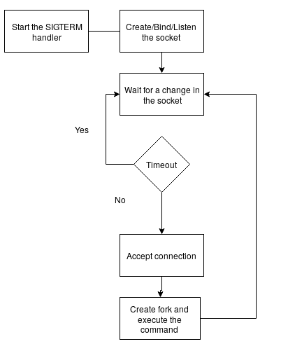

<!-- 

	Bruno Mondelo Giaramita                                    
	mondelob14@gmail.com                                       
	isx48185462                                                
	Escola del Treball de Barcelona 2017-05-18
	
                                                                     -->
                                                                     
# Socket

## About 

In [src/](src) you will find a simple implementation of the
**socket-based activation** in
[socket-activation.c](src/socket-activation.c). The [run.sh](run.sh) will
create an image and a *Docker* based on this work, with port *10001*
and running the script [write-file.py](src/write-file.py). This script
just writes the hour in */tmp/hour*. If connect to socket in the docker,
with a command like **ncat** it will write the hour on the log file.

The work of the program, is basically open a socket and listen on it.
When a connection is accepted executes the order passed by arguments,
imitating the job of **Systemd Socket**. After that the connection
stays openned, but it won't read from this connection.

